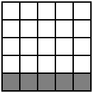
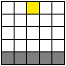
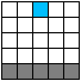

# Automat komórkowy symulujący zachowanie materiałów

Rodzaje komórek:
- pusta (powietrze)
- stałe:
	- stałe statyczne (skała)
	- stałe dynamiczne (piasek)
- gazowe (dym, para wodna)
- płynne (woda)

Aktualizacja automatu:

Aby zapobiec kilkukrotnej aktualizacji, komórki mają flagę hasBeenUpdated, która temu zapobiega.

# Reguły

1. Materiał sypki (np. piasek)

* spadek (wykonywany do momentu natrafienia na komórkę typu stałego lub ośiagnięciu liczby iteracji równej aktualnej prędkości po osi y)
	- sprwadzenie, czy komórka pod spodem jest pusta lub jest płynem
	- jeżeli tak, zamiana miejsc i zwiększenie prędkości
* zsunięcie (wykonywane do momentu natrafienia na komórkę typu stałego lub ośiagnięciu liczby iteracji równej aktualnej prędkości po osi y)
	- wylosowanie strony spadku (lewo lub prawo)
	- sprawdzenie, czy komórka pod spodem na skos jest pusta lub jest płynem
	- jeżeli tak, zamiana miejsc i delikatne zwiększenie prędkości
	- jeżeli nie, sprawdzenie przeciwnego skosu

2. Materiał płynny (np. woda)

* spadek i zsunięcie analogicznie do piasku, z tą różnicą, że woda nie wypiera płynów
* ruch w poziomie (zgodnie z wylosowaną stroną spadku nadana została prędkość po osi x, wykonywane do momentu natrafienia na komórkę typu stałego lub ośiagnięciu liczby iteracji równej aktualnej prędkości po osi x)
	- sprawdzenie, czy komórka na boku jest pusta
	- jeśli tak, zamiana miejsc i zmniejszenie predkości
* po każdej iteracji sprawdzana jest komórka po skosie w dół
	- sprawdzenie komórki pod spodem na skos
	- jeżeli tak, zamiana miejsc i delikatne zwiększenie prędkości

3. Materiał stały (np. skała)
* nic sie tutaj nie dzieje

4. Materiał gazowy (np. dym)

5. Ogień

6. Kwas