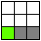

# Automat komórkowy symulujący zachowanie materiałów

Rodzaje komórek:
- pusta (powietrze)
- stałe:
	- stałe statyczne (skała, stal, drewno, liście)
	- stałe dynamiczne (piasek)
- gazowe (dym, para wodna, płomień)
- płynne (woda, kwas)

Aktualizacja automatu:

Aby zapobiec kilkukrotnej aktualizacji, komórki mają flagę hasBeenUpdated, która temu zapobiega.

# Reguły

1. Materiał sypki (np. piasek)

* spadek (wykonywany do momentu natrafienia na komórkę typu stałego lub ośiagnięciu liczby iteracji równej aktualnej prędkości po osi y)
	- sprwadzenie, czy komórka pod spodem jest pusta lub jest płynem
	- jeżeli tak, zamiana miejsc i zwiększenie prędkości (jeżeli komórka jest płynam, ustawienie prędkości na 1)
* zsunięcie (wykonywane do momentu natrafienia na komórkę typu stałego lub ośiagnięciu liczby iteracji równej aktualnej prędkości po osi y)
	- wylosowanie strony spadku (lewo lub prawo)
	- sprawdzenie, czy komórka pod spodem na skos jest pusta lub jest płynem
	- jeżeli tak, zamiana miejsc i delikatne zwiększenie prędkości
	- jeżeli nie, sprawdzenie przeciwnego skosu

2. Materiał płynny (np. woda)

* spadek i zsunięcie analogicznie do piasku, z tą różnicą, że woda nie wypiera płynów, a wypiera gazy
* ruch w poziomie (zgodnie z wylosowaną stroną spadku nadana została prędkość po osi x, wykonywane do momentu natrafienia na komórkę typu stałego lub ośiagnięciu liczby iteracji równej aktualnej prędkości po osi x)
	- sprawdzenie, czy komórka na boku jest pusta lub gazowa
	- jeśli tak, zamiana miejsc i zmniejszenie predkości
* po każdej iteracji sprawdzana jest komórka po skosie w dół
	- sprawdzenie komórki pod spodem na skos
	- jeżeli tak, zamiana miejsc i delikatne zwiększenie prędkości

3. Materiał stały (np. skała)
* nic sie tutaj nie dzieje

4. Materiał gazowy (np. dym)
* losowy czas życia komórki
* wznoszenie
	- sprawdzenie, czy komórka nad jest pusta
	- jeżeli tak, zamiana miejsc
* wznoszenie po skosach
	- wylosowanie strony wzniesienia (lewo lub prawo)
	- sprawdzenie, czy komórka nad na skos jest pusta
	- jeżeli tak, zamiana miejsc
	- jeżeli nie, sprawdzenie przeciwnego skosu
	
5. Ogień
* losowy czas życia komórki
* podpalenia
	- sprawdza 8 otaczających komórek czy są możliwe do podpalenia
	- jeśli tak, losowane jest, czy komórka zostanie podpalona
	- wydziela dym i płomienie
* fizyka analogicznie do piasku, z różnicą jeśli trafi na wodę, zmienia ją w parę wodną

6. Kwas
* przeżeranie
	- sprawdza 8 otaczających komórek czy są możliwe do przeżarcia
	- jeśli tak, losowane jest, czy komórka zostanie przeżarta
* fizyka analogiczna do wody